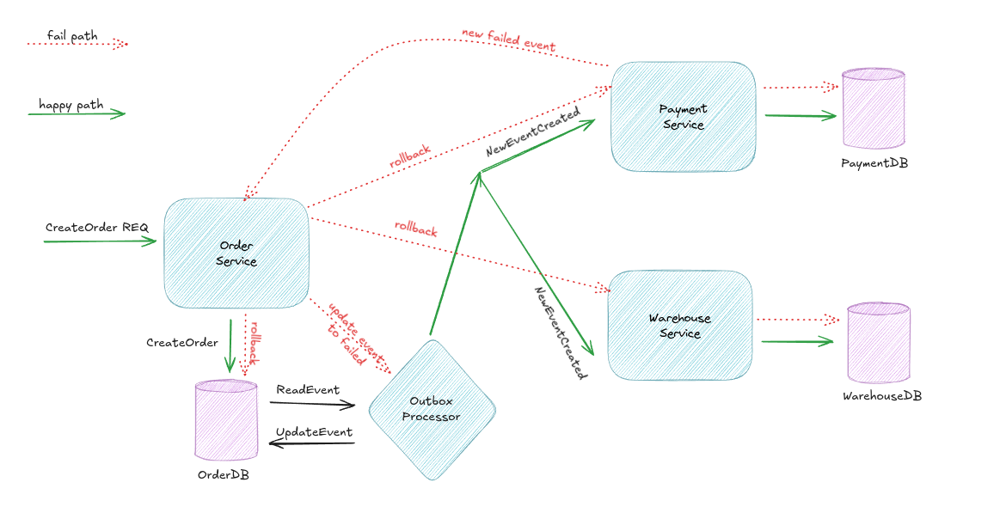
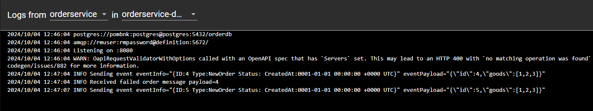
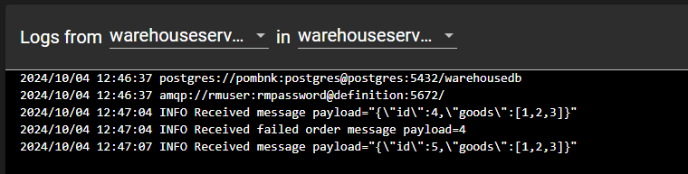
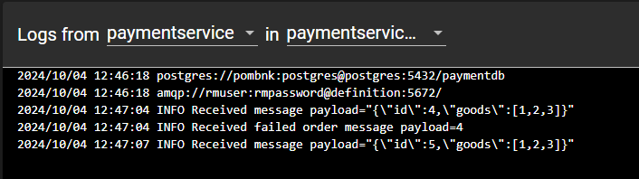
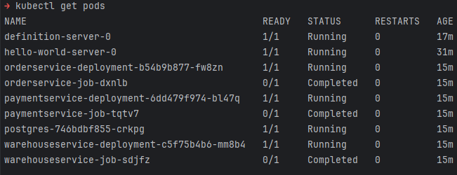
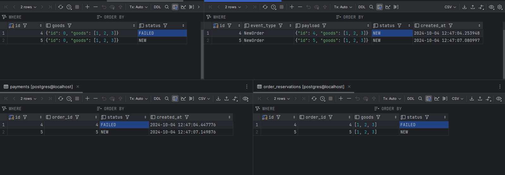

# Saga (orderservice, warehouseservice, paymentservice)

Для запуска необходимо иметь установленный **minikube**, **kubectl**, **helm**. Может понадобиться [rabbitmq operator](https://www.rabbitmq.com/kubernetes/operator/using-operator) 
Также для удобства используйте утилиту **make**

В данном задании была реализована сага с орекстратором в домене сервиса заказа совместно с transactional outbox паттерном
с учетом **ключа идемпотентности** в качестве orderID, реализация показана на диаграмме ниже
(стрелочками между сервисами обозначена передача сообщения через брокер сообщений RabbitMQ) CreateOrder REQ это http запрос по апи извне:


Порядок запуска:

1. Склонировать репозиторий
```shell
    git clone https://github.com/POMBNK/otussaga && cd otussaga
``` 
2. Добавить в файл hosts:
    - 127.0.0.1 arch.homework

затем для старта приложения выполнить команду ```make start```


3. Открыть дашборд миникуба
```shell
minikube dashboard
```

4. Перейти по адресу http://arch.homework/swagger/ 
5. Выполнить вызов /orders, например 2 раза. Тело запроса уже подготовлено

**Выполнение дважды необходимо для искуственного моделирования ошибки (все четные order_id будут моделировать ошибку в сервисе оплаты). 
Это необходимо, чтобы показать как система реагирует на отказы в худщем варианте событий (упали на последнем событии уже после создания заказа и резерва товаров)**

6. Проверить логи сервисов orderservice, warehouseservice, paymentservice. 

Пример логов   

В данном примере товар с order_id = 4 был провален, значит все сервисы должны выполнить компенсирующие действия для отката. 
Проверим состояние в базе, так как обработчики реализовывались только для очередей, без привычного rest api

```shell
kubectl get pods
```


```shell
kubectl port-forward --namespace default postgres-746bdbf855-crkpg 5432:5432

```

Любым удобным способом подключаемся по кредам
```
POSTGRES_DB=postgres
POSTGRES_USER=pombnk
POSTGRES_PASSWORD=postgres
```
Результат 



7. По окончанию работы, очистить helm list + джобы
```shell
make stop
```

